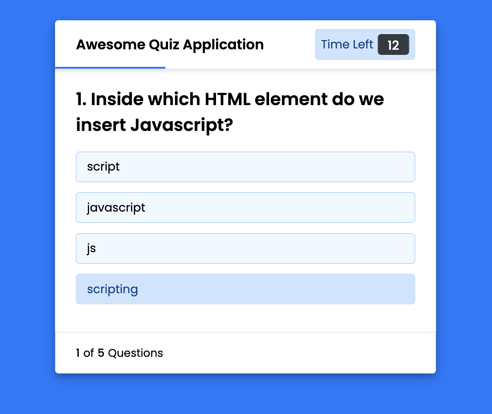

# Coding 101: Quiz

<center>
</img>
</center>

## Table of Contents
  1. [Description](#description) 
  2. [Installation](#installation)
  3. [Usage](#usage)  
  4. [Contributing](#contributing)
  5. [Tests](#tests)
  6. [License](#license)
  7. [Questions](#questions)
  8. [E-mail](#e-mail)


## Description
This application is a timed code quiz, powered by javascript. It includes multiple choice questions that must be answered correctly within the time alotted. 

## Installation
To view the application, open the ```index.html``` file in your default browser. No installation required. The application is also deployed on github pages, the link can be found on the github page.

## Usage
To view the live application, you must open the ```index.html``` file in your default browser. From there you click the start button and the quiz begins. You only have a certain amount of time to answer each question. 

## Contributing
Feel free to reach out with additional questions, including the questino and 4 multiple choice answers, one of which needs to be the correct answer. Contributions can be made on the GitHub repository page or by email, linked below. Please read the contact instructions for more information.

## Tests
There are no tests designed for this application.

## License
 

## Questions
[github icon](./github-icon-small.png)
Github Profile: [dubosews](https://github.com/dubosews)
Contact Email: [wsd10205@gmail.com](mailto:wsd10205@gmail.com)
Directions for reaching out with further questions:
    Feel free to reach out with questions or comments through the Github repository page, or by email. If you would like to reach out by email: ``` Please include the TITLE in the subject line of the email```.
